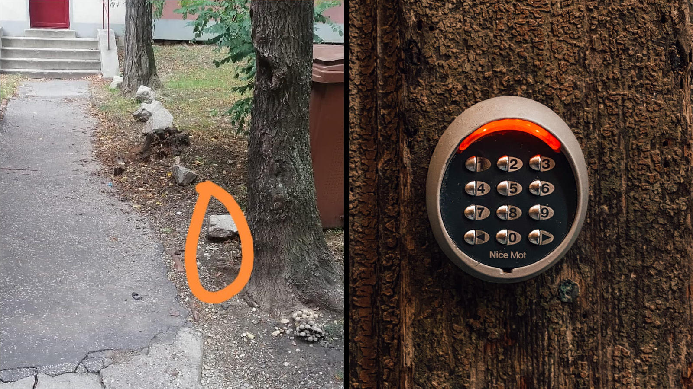

Check this picture out. Can you say why I put these two parts together? There are two stories... 

## Stockholm, Sweden 

5 or 6 years ago, around 2017, I went for a hybrid journey to Stockholm - both to work on some business but also to explore the city. It is an absolutely stunning city, I enjoyed the best coffee, awesome events and very friendly people.

I stayed at an AirBnb place somewhere in [Gullmarsplan](https://en.wikipedia.org/wiki/Gullmarsplan), with a self-checkin option. That was a very nice condo building with pieces of art hanging in the lobby and corridors. And even in the lift. I found the door to the apartment, which had a smart lock with PIN entry buttons. The code was sent to me earlier. I keyed in the code, but the door did not open. I entered the code again, double-checking - no luck. 

OK, it was 13:40, 20 minutes to 2 pm. And the check-in, according to the house rules, starts at 2 pm. The lock was smart enough to only let me in at the checkin time, or at least that was my thinking. 

So I waited for some time, and at 2 pm strict I could get in and happy to finally relax.

## Bratislava, Slovakia 

Several months ago (September 2022, for the records) I arrived to a beautiful city of Bratislava. I was about to stay for a few weeks in an AirBnb space. Good internet connection, nice and lovely flat, close to the center. 

Also a self-checkin property. On the listing, host mentioned there should be a locker box with dial pad to get the keys out and then get into the property. When I got to the apartment block location, I inspected the suggested location, but found no locker box at all - oops! Luckily, the host was super-responsive and picked up the call fast. They apologized for the inconvenience, and told me they would send an updated instructions to my phone. Sorry, they said, and hang up. And so they did - they sent me the updated instruction. 

Actually that was a photo of the surroundings of the building, where I was standing, with a stone lying on the floor, circled to bring my attention to it. They key is under the stone, they also texted. 

This story ended just as well as Stockholm one - I recovered the key, self-checked-in, and eventually was enjoying a good showers just in few minutes. Except one old lady was arguing at me in Slovak; if I got it right she was about to call cops as she thought I was a drug addict looking for a dose or something.

## Product and Technology

What is common in these two stories? Self-checkin. Abstracting a little, 'self-checkin' is a very handy feature of the 'short-term stay' as a service: 

* You arrive when you like. 2am at night? No problem, and no need to wake the host up to let you in. 
* No need to arrange meeting in time and space. So, less communication and fewer possible errors.
* Also good for the hosts as they can arrange disconnected workflows like letting in cleaning staff, and so can operate in a distributed fashion.

There are multiple ways one can implement the 'self-checkin' feature. In recent few years hosts started to buy little lockboxes with dial codes. These boxes are secured to walls, or attached to objects like stairacses themselves like a padlock. What you need to do is to find such a box and use the code to get the key. When checking out, you either leave keys in the place, or you put those back into the locker box. Cleaning or handling staff can take the box out of there then, to get ready for the next guest. It is so handy that there are [ratings of lockboxes](https://airhostacademy.com/5-best-airbnb-key-lockboxes-top-rated/). Neat it is, right?

So what happens here, is that we are applying technology (smart locks, locker boxes, or even a stone) to implement a feature. 

While hi-tech solutions are very natural for forward-thinking early adopters, specifically for the tech crowd, I would argue that simplicity oftentimes wins over advanced features.

It must be very nice to be able to open the door lock from your phone, or change PIN code on the go. At the same time, if the batteries deplete, or connectivity is lost, you might find yourself in a bad situation. There is a good saying - all it works well until it does not.

Technology often comes with liabilities though. If you use a smart, connected lock, you would need to replace batteries on time, and also arrange for a backup plan if something goes wrong. If you build a software system, you have to feed resource to just maintain it - fix the bugs, migrate to new and updated versions of the language, platform, libraries, and API it consumes, which evolve independently of your will.

Thus, the stone is a climax of simplification for the 'self check-in' feature.

## Thoughts 

This situation made me think about how we solve problems and design features, and if the use of technology in this or that specific case has been assessed. 

Let us be clear, I am not arguing here for any particular level of technology you might want to apply for your product. It depends on many things - who are you, what is the product, what maturity stage are you in and so on. I am arguing that having a mindful decision is what makes sense. 

It is worth trying to think outside of a box, even if it is a lockbox. &#9209;

Credits: 

* Digital Lock Photo by [Jan Antonin Kolar](https://unsplash.com/@jankolar?utm_source=unsplash&utm_medium=referral&utm_content=creditCopyText) on [Unsplash](https://unsplash.com/s/photos/code-lock?utm_source=unsplash&utm_medium=referral&utm_content=creditCopyText)
  
